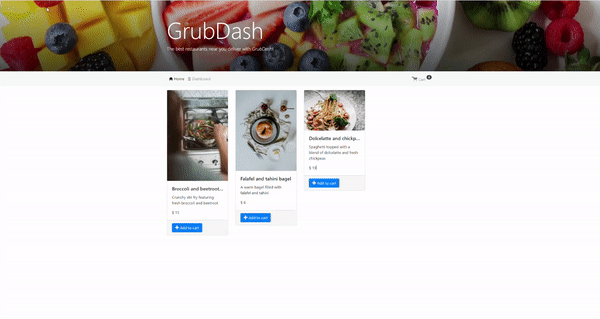

# GrubDash_Project

This app replicates GrubHub by allowing users to see dishes with their descriptions and being able to add them to their cart. They can also save their address so that they app remembers for delivery purposes.

## Motivation

I developed this as part of my project for the Thinkful Software Engineering course. It is a back-end project that uses Thinkful's front-end starter linked below.

## Demo

## Technology

Built with

- JavaScript
- HTML/CSS
- Node.js
- Express

## Features

- Add to Cart button
- Create a dish allows user to add a name, description, image url, and price
- Dashboard that displays current orders and dishes (in the future, dashboard will not be visible to all users, only owners)
- Check out feature: allows user to add delivery address, phone number, and displays items, quantity and total price

## Installation

This is Back-End project, please go to https://github.com/Thinkful-Ed/starter-grub-dash-front-end and follow the installation guide to get the Front-End to run

1. Fork and clone this repository
2. Run `npm install` to install project dependencies
3. Run `npm start` to start your server
4. Make sure to start the front-end server(linked above) at the same time

If you have trouble getting the server to run, feel free to reach out to me!

## Contributing

Pull requests are welcome. For major changes, please open an issue first to discuss what you would like to change.

Please make sure to update tests as appropriate.

## Credits

Starter from @ [Thinkful](https://github.com/Thinkful-Ed)

## Author

[Anon Vanichyanukroh](https://github.com/avthedev)
